# NeuralSS: neural super-sampling and frame generation for games

NeuralSS is a research project for open, hardware-agnostic neural reconstruction in games. It has two networks:

- **Temporal super-resolution (TSR):** a small recurrent network that turns jittered low-resolution game frames (3x and 2x, for example 640x360 to 1920x1080) into full-resolution frames, using motion vectors, depth and its own history.
- **Frame generation (FG):** a small network that creates an in-between frame (interpolation) or a future frame (extrapolation) from two real frames, copies HUD and subtitles from the newest real frame instead of blending them, and skips generation on scene cuts.

Both networks fold into plain 3x3 convolution chains and export to ONNX. Everything is trained and evaluated in three Kaggle notebooks (GPU T4 x2) built from one shared Python library. All three notebooks have run on Kaggle, and their downloaded outputs (metrics, plots, logs, weights) are in this repository.

The full research plan, design rationale, competitive analysis and dataset licences are in [RESEARCH.md](RESEARCH.md). This README covers how the repository works, how to run it, and what each notebook produced.

## Table of contents

- [Quick start](#quick-start)
- [Project status](#project-status)
- [How it works](#how-it-works)
- [Tech stack](#tech-stack)
- [Repository structure](#repository-structure)
- [Local development](#local-development)
- [Notebook 1: data pipeline](#notebook-1-data-pipeline)
- [Notebook 2: temporal super-resolution](#notebook-2-temporal-super-resolution)
- [Notebook 3: frame generation](#notebook-3-frame-generation)
- [Weights and exported models](#weights-and-exported-models)
- [Known limitations](#known-limitations)
- [Troubleshooting](#troubleshooting)
- [Licence](#licence)

## Quick start

The notebooks run on Kaggle, not locally. Training and evaluation need two GPUs and the attached datasets.

1. **Create the data-pipeline notebook on Kaggle.** Upload [neural-data-pipeline/neural-data-pipeline.ipynb](neural-data-pipeline/neural-data-pipeline.ipynb). In the notebook settings choose **Accelerator: GPU T4 x2** and turn **Internet on**. Attach these Kaggle datasets (**Add Input**): `soumikrakshit/div2k-high-resolution-images`, `daehoyang/flickr2k`, `amithkesavmrajagiri/reds-dataset`, `wangsally/vimeo-90k-7`, `chenshu123/vimeo-triplet`, `artemmmtry/mpi-sintel-dataset`, `uom200647r/vid4-dataset`. An optional Kaggle secret `HF_TOKEN` raises Hugging Face download limits.
2. **Run it** with **Save Version > Save & Run All**. Expected result: about 0.6 hours; the output contains `nss_data/nss_manifest.parquet` and `outputs.zip`.
3. **Create the two training notebooks** from [neural-supersampling/neural-supersampling.ipynb](neural-supersampling/neural-supersampling.ipynb) and [neural-frame-generation/neural-frame-generation.ipynb](neural-frame-generation/neural-frame-generation.ipynb) with the same accelerator, Internet and datasets, and also attach the pipeline notebook's output (**Add Input > Notebook output**).
4. **Run each one** with **Save & Run All**. Expected result: about 7.2 hours (super-resolution) and 6.5 hours (frame generation) with the current training budgets, within the notebooks' 9.5-hour ceiling and Kaggle's 12-hour session limit; `outputs.zip` and every file appear in the notebook's **Output** tab. Together the two runs use about 14 hours of Kaggle's weekly GPU quota.
5. **Optional smoke test:** set `QUICK_RUN = True` in the configuration cell for a short run of every cell (about 40 minutes).

Common errors:

| Problem                                                            | Fix                                                                                                                                                       |
| :----------------------------------------------------------------- | :-------------------------------------------------------------------------------------------------------------------------------------------------------- |
| `AssertionError: Select the GPU T4 x2 accelerator`                 | Set **Accelerator** to **GPU T4 x2**; the notebooks run one training process per GPU                                                                      |
| The version shows no logs and ends with `ERRORED_MOUNTING_DATASET` | One attached dataset failed to mount, so no code ran. Remove or re-add that dataset and save again; the notebooks leave out sources that are not attached |
| `No texture sources found`                                         | Neither the pipeline output nor the Kaggle datasets are attached                                                                                          |
| A pip install fails                                                | Internet is off. `lpips`, `flip-evaluator` and `onnxruntime` are optional; their absence is logged and the matching metric or check is skipped            |

## Project status

| Notebook                  | Kaggle run            | Duration | Result                                                                                                                                                                       |
| :------------------------ | :-------------------- | :------- | :--------------------------------------------------------------------------------------------------------------------------------------------------------------------------- |
| `neural-data-pipeline`    | 18 October 2026       | 0.63 h   | 12,300 items split into 8,874 train, 1,087 val and 1,432 test with zero cross-split duplicates                                                                               |
| `neural-supersampling`    | 20 to 21 October 2026 | 5.34 h   | 3x student 33.67 dB PSNR-Y on synthetic game scenes against 29.36 dB for an analytic TAA upscaler; the teacher trained (33.72 dB validation) and the GameIR native suite ran |
| `neural-frame-generation` | 20 to 21 October 2026 | 4.93 h   | Interpolation beats motion-vector reprojection on 5 of 6 suites (Sintel 0.05 dB below); UI ghosting rate 0.063 against 0.336                                                 |

Both training runs started at 20:31 on 20 October 2026 and finished after midnight (Kaggle clock, from the notebook logs). No training run failed in either notebook (`metrics/failed_runs.json` is empty).

**Changes made after these runs, not yet measured on Kaggle.** A review of the outputs found evaluation defects, now fixed in the notebooks in this repository:

1. **The bicubic TSR baseline ignored the sub-pixel jitter.** `nss_eval.run_bicubic` upsampled each jittered low-resolution frame as if it were unjittered, which shifts the image by up to 1.5 output pixels per frame. That explains why bicubic scored below bilinear on every suite except the jitter-free GameIR native suite (32.33 against 32.30 dB), and why its temporal-change error was 1.4 to 2.2 times that of bilinear. Both baselines now sample at the true jittered positions (`nss_models.jitter_upsample`).
2. **TSR motion vectors on video suites came from RAFT on the jittered low-resolution inputs**, so they also contained the jitter difference between frames, while training used RAFT on clean full-resolution frames. Evaluation now runs RAFT on the full-resolution frames and samples the flow at the jittered positions, exactly as for exact motion. This affects Vid4, Vimeo-1080p and GameIR, the suites where the students lost to bilinear.
3. **Degenerate test clips.** One TSR and two FG Vimeo-1080p test clips are blank (every baseline reaches the 100 dB PSNR cap, while the networks score between 71 and 100 dB), and one FG clip has a scene cut inside its four frames (9.9 dB for every method). They decided that suite's ranking: without them, FG Vimeo-1080p interpolation reads student 36.52 dB, MV reprojection 35.92, teacher 40.67, instead of the reported 44.88, 44.43 and 43.21. Both notebooks now load test clips through `nss_eval.test_clips`, which skips blank clips and, for FG, frozen clips and clips with a cut or flash (`nss_eval.clip_defects`).
4. **Longer training.** Every validation curve was still rising when its cosine schedule ended, and both runs used about half of the 9.5-hour budget. Budgets are now 140 / 120 / 75 / 20 minutes (TSR teacher, student, pair, ablation; previously 100 / 80 / 50 / 20) and 100 / 120 / 75 / 20 minutes for FG (previously 70 / 80 / 50 / 20).
5. Smaller fixes: the FG summary no longer lists empty extrapolation entries for Vimeo-90K triplets (they have no fourth frame) and now covers Sintel and Vid4; the FG visual comparison saves its frames to `predictions/`, as its description said; `lpips` no longer prints two torchvision deprecation warnings per training run; comments that the formatter had split across lines are readable again.

The executed notebooks of these runs, with every output, are kept at [neural-supersampling/outputs/neural-supersampling.executed.ipynb](neural-supersampling/outputs/neural-supersampling.executed.ipynb) and [neural-frame-generation/outputs/neural-frame-generation.executed.ipynb](neural-frame-generation/outputs/neural-frame-generation.executed.ipynb); the notebooks next to them are the current versions without outputs. The exact library code each run used is in its `outputs/code/` folder.

## How it works

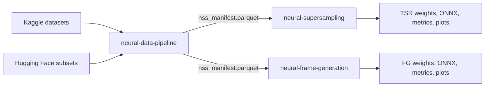
```mermaid
flowchart LR
    K[Kaggle datasets] --> P[neural-data-pipeline]
    H[Hugging Face subsets] --> P
    P -->|nss_manifest.parquet| T[neural-supersampling]
    P -->|nss_manifest.parquet| G[neural-frame-generation]
    T --> TO[TSR weights, ONNX, metrics, plots]
    G --> GO[FG weights, ONNX, metrics, plots]
```

1. **Data pipeline.** Discovers images and videos on Kaggle and Hugging Face, filters unusable items, detects copies across all sources with hashes, DINOv2 embeddings and SIFT verification, and writes a leakage-safe train / validation / test manifest.
2. **Training data.** Both training notebooks decode the manifest into memory-mapped caches. Each training batch mixes _synthetic_ game-like scenes, rendered on the GPU from still images with exact motion vectors, disocclusions, thin geometry, particles and HUD overlays, with _real_ sequences (TartanAir and Sintel with exact flow; video with RAFT-estimated motion).
3. **Training.** DDP on both GPUs with FP16, EMA weights and a wall-clock cosine schedule: a teacher first, then students that learn from the teacher and the ground truth, then smaller tiers and ablations, two runs in parallel (one per GPU).
4. **Evaluation.** Test-split suites only, against analytic baselines, with spatial, temporal, region, UI and latency metrics, then fusion to plain convolutions and ONNX export.

**Library and build.** The library lives once in [src/neuralss/](src/neuralss/). [tools/build_notebooks.py](tools/build_notebooks.py) turns the percent-format sources in [notebooks/](notebooks/) into `.ipynb` files and embeds every library module as a `%%writefile` cell, so each notebook is self-contained on Kaggle.

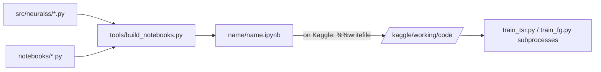
```mermaid
flowchart LR
    S[src/neuralss/*.py] --> B[tools/build_notebooks.py]
    N[notebooks/*.py] --> B
    B --> I[name/name.ipynb]
    I -->|on Kaggle: %%writefile| W[/kaggle/working/code/]
    W --> TR[train_tsr.py / train_fg.py subprocesses]
```

## Tech stack

| Component                              | Version (where known)              | Purpose and where used                                                                                          |
| :------------------------------------- | :--------------------------------- | :-------------------------------------------------------------------------------------------------------------- |
| Python                                 | 3.10.12 (all three runs)           | Notebook and library language                                                                                   |
| PyTorch with CUDA                      | 2.0.0 / CUDA 11.8 (all three runs) | Models, GPU renderer, DDP training (`torch.distributed.run`), FP16 autocast; the library supports 2.0 and later |
| torchvision                            | Kaggle image                       | RAFT-small optical flow (motion for video, tOF metric), AlexNet weights for the LPIPS fallback                  |
| Hugging Face Transformers              | Kaggle image                       | DINOv2-small embeddings for copy detection (`nss_dedup.py`)                                                     |
| OpenCV, Pillow, NumPy, pandas, PyArrow | Kaggle image                       | Decoding, SIFT features, HUD text tiles, caches, manifest (`nss_manifest.parquet`)                              |
| matplotlib, tqdm                       | Kaggle image                       | Plots and progress bars                                                                                         |
| `lpips`                                | installed by the notebooks         | Perceptual loss and metric (optional)                                                                           |
| `flip-evaluator`                       | installed by the notebooks         | NVIDIA FLIP metric for static convergence (optional)                                                            |
| `onnxruntime`                          | installed by the notebooks         | ONNX export parity check (optional)                                                                             |
| nbformat                               | 5.11.1 (local `.venv`)             | Local notebook build and check (`tools/build_notebooks.py`)                                                     |
| black, pyflakes                        | 26.10.1, 4.0.3 (local `.venv`)     | Local formatting and lint checks                                                                                |

## Repository structure

```text
.
|-- README.md                       this file
|-- RESEARCH.md                     research plan, design, datasets, measured results, limitations, licences
|-- src/neuralss/                   single source of the shared library (embedded into every notebook)
|   |-- nss_common.py               run folders, logger, stage timer, hardware report, pip helper, training launcher with watchdog
|   |-- nss_data.py                 source registry, discovery, Hugging Face range access, decoding, manifest I/O
|   |-- nss_dedup.py                pHash / dHash, DINOv2 embeddings, GPU neighbour search, SIFT + RANSAC, leakage-safe split
|   |-- nss_pipeline.py             data-pipeline steps and the inline fallback used by the training notebooks
|   |-- nss_cache.py                memory-mapped training caches and RAFT teacher motion
|   |-- nss_synth.py                GPU renderer of synthetic game-like scenes and batch builders
|   |-- nss_models.py               RepConv, jitter-aware upsampling, TSR and FG networks, tiers, fusion, ONNX wrappers
|   |-- nss_metrics.py              losses, PSNR / SSIM / LPIPS / FLIP, RAFT, temporal metrics, baselines, latency model
|   |-- nss_train.py                DDP training loop, batch streaming, EMA, checkpoints, retry launcher
|   |-- nss_eval.py                 test clips with a defect filter, input construction, method runners, metric rows
|   |-- train_tsr.py                TSR training entry point (one process per GPU)
|   `-- train_fg.py                 FG training entry point
|-- notebooks/                      percent-format notebook sources (markdown and code cells)
|-- tools/build_notebooks.py        builds the .ipynb files from notebooks/ and src/neuralss
|-- neural-data-pipeline/
|   |-- neural-data-pipeline.ipynb  executed notebook with saved outputs (run of 18 October 2026)
|   `-- outputs/                    code/, logs/, metrics/, plots/, nss_data/nss_manifest.parquet
|-- neural-supersampling/
|   |-- neural-supersampling.ipynb  current notebook (fixes after the run), no outputs
|   `-- outputs/                    run of 20 to 21 October 2026: code/, logs/, metrics/, plots/, predictions/, weights/,
|                                   neural-supersampling.executed.ipynb (the run's notebook with all outputs)
|-- neural-frame-generation/
|   |-- neural-frame-generation.ipynb  current notebook (fixes after the run), no outputs
|   `-- outputs/                    run of 20 to 21 October 2026: code/, logs/, metrics/, plots/, weights/,
|                                   neural-frame-generation.executed.ipynb
|-- .gitignore                      ignores .venv/, caches, *.zip archives and Kaggle __notebook__.ipynb copies
|-- .gitattributes                  line-ending normalisation
`-- .prettierrc.json                Markdown / JSON formatting settings
```

Inside every `outputs/` folder: `code/` holds the library and per-run JSON configs exactly as written on Kaggle, `logs/` the notebook log and one log per training run, `metrics/` every CSV and JSON result, `plots/` every figure.

## Local development

There is no local training or test suite: the notebooks are verified on Kaggle. Local work is editing the library or notebook sources and rebuilding the notebooks.

```powershell
python -m venv .venv
.venv\Scripts\python -m pip install nbformat black pyflakes --cache-dir .cache\pip
```

| Command (repository root)                                            | What it does                                                                                                                                  |
| :------------------------------------------------------------------- | :-------------------------------------------------------------------------------------------------------------------------------------------- |
| `.venv\Scripts\python tools\build_notebooks.py`                      | Rebuilds every notebook whose sources changed (written without outputs); unchanged notebooks, including executed copies, are left as they are |
| `.venv\Scripts\python tools\build_notebooks.py --check`              | Exits with code 1 and lists stale notebooks if any `.ipynb` cell id, type or source differs from a fresh build; outputs are ignored           |
| `.venv\Scripts\python -m pyflakes src\neuralss tools notebooks`      | Lint (no output means clean)                                                                                                                  |
| `.venv\Scripts\python -m black --check src\neuralss tools notebooks` | Formatting check                                                                                                                              |

Workflow: edit `src/neuralss/*.py` or `notebooks/*.py`, run the build, then `--check`, pyflakes and black. Never edit the `.ipynb` files by hand; they are generated. Note that the build rewrites a notebook without outputs whenever its sources change, so copy an executed notebook into its `outputs/` folder first if its outputs must be kept.

## Notebook 1: data pipeline

[neural-data-pipeline/neural-data-pipeline.ipynb](neural-data-pipeline/neural-data-pipeline.ipynb) keeps its saved outputs from the run of 18 October 2026 (Kaggle GPU T4 x2, PyTorch 2.0.0, 4 CPU cores, 31.3 GB RAM). All numbers below are printed in the notebook or saved in [neural-data-pipeline/outputs/metrics/](neural-data-pipeline/outputs/metrics/).

**Sections 1 to 4: library, setup, hardware, configuration.** Writes the four library modules used by the pipeline (`nss_common`, `nss_data`, `nss_dedup`, `nss_pipeline`), loads the `HF_TOKEN` secret, and reports 2 Tesla T4 GPUs (14.56 GB each). Hugging Face caps: game stills (1,200 train, 250 test), TartanAir 120 frames per environment in sequences of 24, GameIR (40, 30) clips, Vimeo-1080p (160, 40) videos. Copy-detection settings: 16 neighbours, retrieval recall 0.98, 400 SIFT features, audit with 5 neighbours and at most 3 rounds.

**Section 5: Kaggle discovery (1.7 min).** Saved to `discovery_kaggle.csv`.

| Source          | Files listed | Items | Test items |
| :-------------- | -----------: | ----: | ---------: |
| div2k           |          900 |   900 |        100 |
| flickr2k        |        2,650 | 2,650 |          0 |
| reds            |       22,100 |   221 |          0 |
| vimeo_septuplet |       40,005 | 5,715 |          0 |
| vimeo_triplet   |        3,000 | 1,000 |      1,000 |
| sintel          |        3,256 |    46 |         10 |
| vid4            |          171 |     4 |          4 |

**Section 6: Hugging Face materialisation (14.2 min).** 1,764 items, 13.64 GB: 1,200 + 250 game stills, 12 TartanAir training environments and 2 test environments (`japanesealley`, `seasidetown`), 40 + 30 GameIR clips, 134 + 40 Vimeo-1080p videos. Catalogue (`catalogue_summary.csv`): 12,300 items; exact motion for Sintel and TartanAir, depth for TartanAir and GameIR.

**Section 7: catalogue overview.**

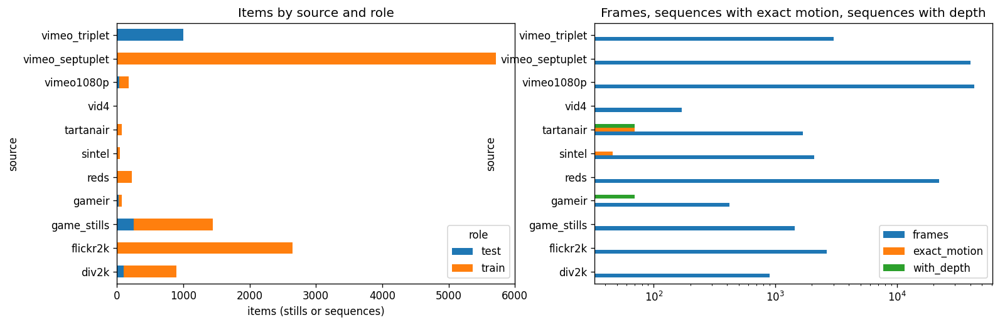

_Items and frames per source, split by training and test role._

**Section 8: keyframe statistics (12.0 min).** 13,322 keyframes, 0 decode failures (`keyframe_stats.csv`). Median size per source ranges from 448x256 (Vimeo-90K) to 2040x1356 (DIV2K, Flickr2K); median sharpness from 216 (Vimeo-90K septuplet) to 1,704 (Vid4).

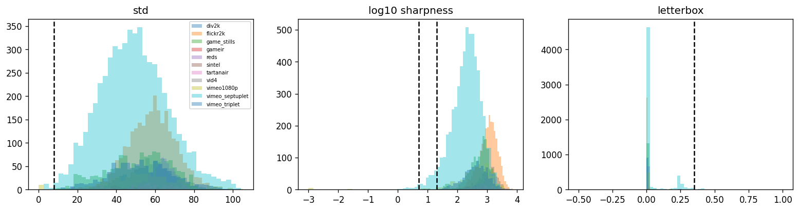

_Distributions of size, contrast, sharpness, letterboxing and colourfulness per source._

**Section 9: filtering (0.3 min).** Kept 12,149 of 12,300 items. Rejections by reason (an item can have several): Vimeo-90K septuplet 43 blurry, 17 flat, 71 letterboxed; game stills 2, 3, 26; Vimeo-1080p 1, 2, 2; Vimeo-90K triplet 1, 0, 2.

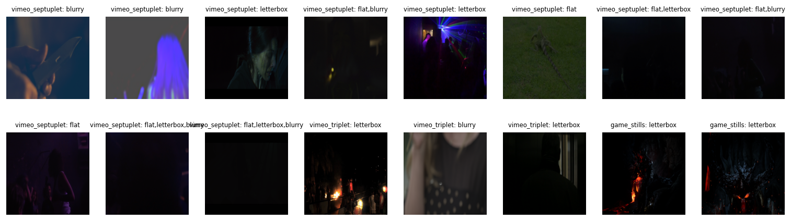

_Examples of rejected keyframes with their reasons._

**Sections 10 to 12: hashes, embeddings, local features.** pHash mean bit 0.500 and dHash 0.480 (balanced). DINOv2 embeddings (13,322 x 384) on both GPUs in 16 s. SIFT: median 368 keypoints per keyframe; 273 keyframes have fewer than 20.

**Section 13: threshold calibration (0.9 min).** 1,500 synthetic copies against 2,930 random and 998 hard negatives (`dedup_calibration.json`, `calibration_scores.csv`).

| Signal            | Threshold               | Recall                            | Most similar negative              |
| :---------------- | :---------------------- | :-------------------------------- | :--------------------------------- |
| DINOv2 retrieval  | `t_ret` 0.6075          | 0.98                              | cosine 0.9348                      |
| DINOv2 strong     | `t_strong` 0.9648       | 0.038                             | cosine 0.9348                      |
| SIFT verification | `t_cells` 10            | 0.9493                            | 8 cells                            |
| pHash             | `h_exact` 6, `h_cand` 6 | 0.9987 (light copies)             | Hamming 18                         |
| Combined rule     |                         | 0.9673 (light 0.9947, heavy 0.94) | 1 false positive, precision 0.9993 |

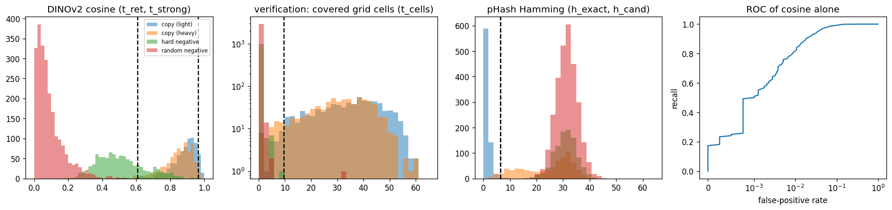

_Score distributions of synthetic copies against negatives, with the chosen thresholds._

**Section 14: copy detection (1.4 min).** 13,165 keyframes searched; 45,213 embedding and 849 pHash candidates, 27,044 unique pairs; 3,346 edges (3,304 verified, 37 strong embedding, 5 exact hash). Most edges join game frames to each other (2,873); cross-source edges link Vimeo-90K septuplets to Vimeo-1080p (78) and to Vimeo-90K triplet test clips (104). Pairs are in `duplicate_pairs.csv`.

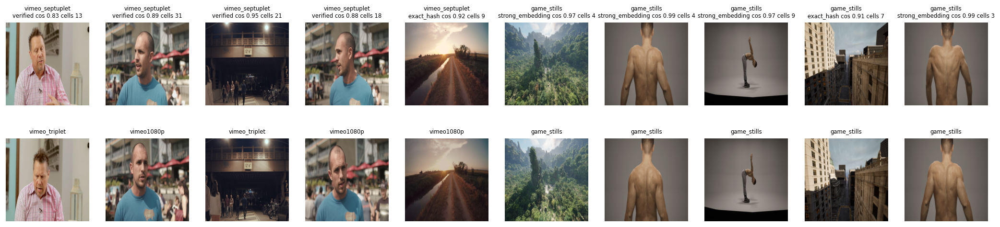

_Examples of detected duplicate pairs with the rule that matched them._

**Section 15: leakage-safe split with audit (1.3 min).** Audit round 1 found 24 cross-split duplicates (added as edges and re-split); round 2 found none. Final: 3,370 edges, largest duplicate cluster 50 items, 3,956 train and validation components (largest 2,936).

| Source          |     Train |       Val |      Test |    Drop | Filtered |
| :-------------- | --------: | --------: | --------: | ------: | -------: |
| div2k           |       755 |        43 |       100 |       2 |        0 |
| flickr2k        |     2,497 |       153 |         0 |       0 |        0 |
| game_stills     |       502 |        41 |       243 |     636 |       28 |
| gameir          |        40 |         0 |        30 |       0 |        0 |
| reds            |       209 |        12 |         0 |       0 |        0 |
| sintel          |        36 |         0 |        10 |       0 |        0 |
| tartanair       |        60 |         0 |        10 |       0 |        0 |
| vid4            |         0 |         0 |         4 |       0 |        0 |
| vimeo1080p      |       120 |         3 |        38 |      10 |        3 |
| vimeo_septuplet |     4,655 |       835 |         0 |     108 |      117 |
| vimeo_triplet   |         0 |         0 |       997 |       0 |        3 |
| **Total**       | **8,874** | **1,087** | **1,432** | **756** |  **151** |

Every dropped item is a duplicate of a test item (`split_report.json`, `split_by_source.csv`).

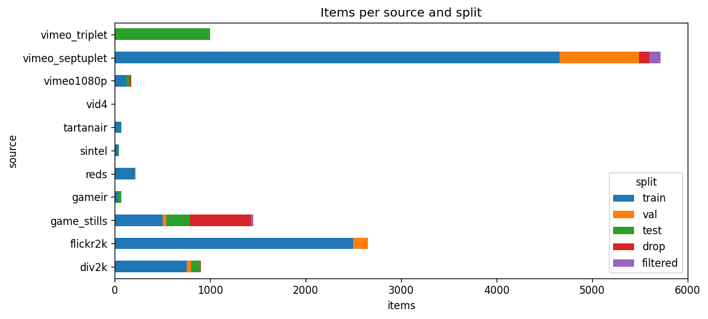

_Items per split and source after the audit._

**Section 16: audit statistics.** `leakage_audit.csv`; `leakage_violations.csv` has a header and no rows (no cross-split duplicate after round 2).

| Split | Reference | Max cosine (median) | Max verified cells (median) | Min pHash Hamming (median) |
| :---- | :-------- | :------------------ | :-------------------------- | :------------------------- |
| val   | train     | 0.9614 (0.5757)     | 9 (0)                       | 8 (16)                     |
| test  | train+val | 0.9570 (0.5745)     | 9 (0)                       | 0 (16)                     |

The pHash distance of 0 is not a duplicate under the rule (untextured keyframe or rejected by dHash).

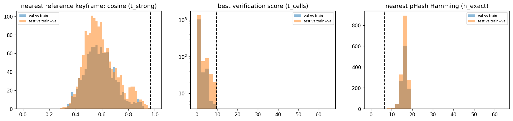

_Nearest-neighbour similarity of validation and test keyframes to the training split, against the thresholds._

**Sections 17 to 19: manifest, summary, packaging.** Writes `nss_data/nss_manifest.parquet` and `dataset_card.csv` (source, host, licence, counts per split), `summary.json`, and a 31-file `outputs.zip`. Stage times (`stage_times.csv`, minutes): discovery 1.66, Hugging Face 14.24, keyframe stats 11.95, filters 0.26, hashes 0.13, embeddings 0.36, SIFT 5.09, calibration 0.94, duplicate search 1.38, split and audit 1.34.

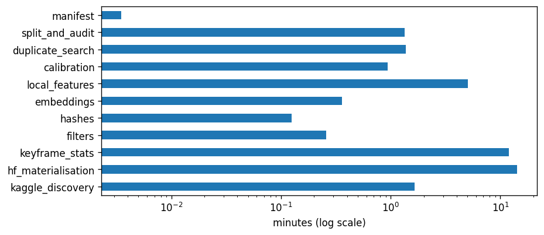

_Minutes per pipeline stage._

## Notebook 2: temporal super-resolution

Run of 20 to 21 October 2026 (PyTorch 2.0.0, CUDA 11.8, Python 3.10.12, 2 x Tesla T4, 4 CPU cores, 31.3 GB RAM; 5.34 hours; no failed runs). Outputs: [neural-supersampling/outputs/](neural-supersampling/outputs/); executed notebook: [neural-supersampling.executed.ipynb](neural-supersampling/outputs/neural-supersampling.executed.ipynb). The current notebook differs from the one that ran by the fixes listed under [Project status](#project-status); the numbers below are from the run.

**Sections 1 to 4: library, setup, hardware, configuration.** Writes the ten library modules and `train_tsr.py`; `lpips`, `flip-evaluator` and `onnxruntime` all installed. Main settings (`metrics/config.json`): 3x primary and 2x secondary scale, 192-px output patches, 6-frame sequences, 40 percent real windows per batch, learning rate 2e-3 (teacher 1e-3), loss weights gradient 0.1, Fourier 0.05, temporal 0.5, LPIPS 0.05, distillation 0.5. Budgets in this run: teacher 100 min, student 80, pair 50, ablations 20 per pair; caches 30 min (the current notebook uses 140, 120, 75 and 20).

**Section 5: manifest.** Loaded from the attached pipeline output; every source was reachable (`reachable_sources.json`).

**Section 6: item selection.** 4,123 texture and 5,120 sequence items for training, 252 and 850 for validation.

**Section 7: caches (19.6 min, 9.30 GB).** 256 validation and 6,500 training still crops (5 decode failures); 192 validation and 3,600 training windows, with RAFT motion for the 192 validation and 3,533 training windows without exact motion. Training windows by source: Vimeo-90K 3,267, REDS 149, Vimeo-1080p 91, TartanAir 39, Sintel 28, GameIR 26; validation windows: Vimeo-90K 188, REDS 4 (`caches.json`).

**Section 8: cache inspection.** 1.9 percent of windows have exact motion and 98.1 percent RAFT motion; 1.8 percent have depth; mean motion 1.50 px per frame.


_Random 512x512 still crops used as textures by the synthetic renderer._

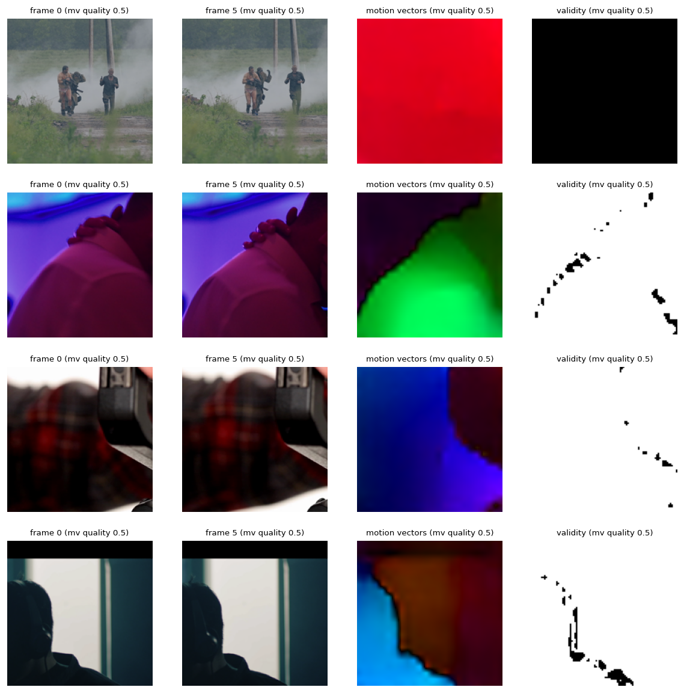

_Real windows: first and last frame, motion vectors (hue = direction, brightness = magnitude) and validity._

**Section 9: synthetic renderer preview.**

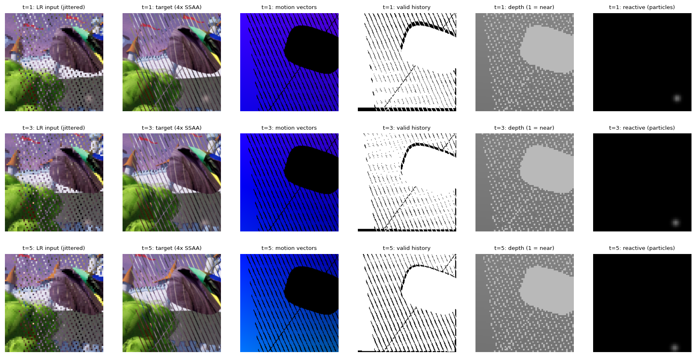

_One synthetic sequence at three time steps: aliased jittered input, anti-aliased target, exact motion vectors, valid history, depth and particle (reactive) mask._

**Section 10: model tiers.** Measured with forward hooks (`model_tiers.csv`); fused-versus-unfused parity 0.0 for every tier.

| Tier    | Scale | Train params | Fused params | GMAC per 1080p frame |
| :------ | ----: | -----------: | -----------: | -------------------: |
| igpu    |     3 |       27,852 |       21,196 |                 4.84 |
| igpu    |     2 |       21,832 |       16,136 |                 8.29 |
| low     |     3 |      132,284 |       99,020 |                12.91 |
| low     |     2 |      123,264 |       91,440 |                25.12 |
| mid     |     3 |      282,100 |      207,924 |                23.96 |
| mid     |     2 |      270,080 |      197,824 |                48.69 |
| high    |     3 |      783,316 |      567,220 |                62.57 |
| high    |     2 |      765,296 |      552,080 |               132.95 |
| teacher |     3 |    1,920,452 |    1,373,508 |               144.42 |
| teacher |     2 |    1,896,432 |    1,353,328 |               314.49 |

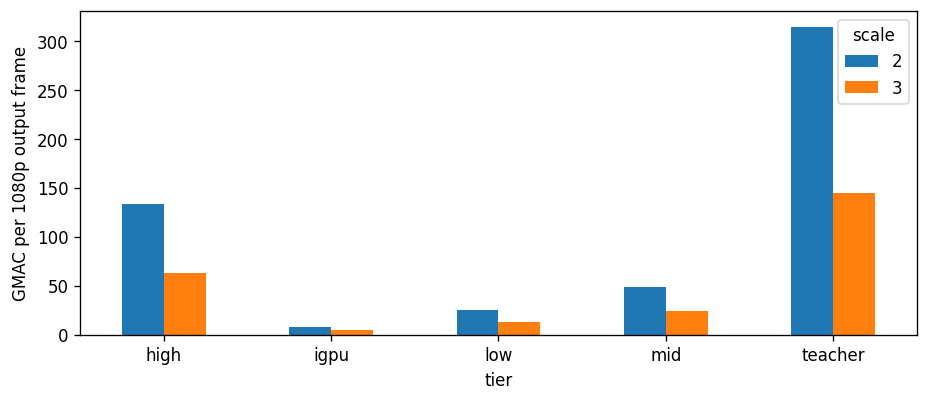

_GMAC per 1080p output frame for each tier at 3x and 2x._

**Section 11: batch probe (0.5 min).** Every size up to 48 fit with a finite loss at initialisation (the zero-initialised RepConv side branches removed the FP16 overflow of the first run); 48 per GPU was chosen for all runs (`batch_probe.csv`).

| Batch | Teacher VRAM % | Teacher seq/s | Student + teacher VRAM % | Student seq/s |
| ----: | -------------: | ------------: | -----------------------: | ------------: |
|     4 |            4.6 |          14.8 |                      1.9 |          15.2 |
|     8 |            7.3 |          25.6 |                      3.1 |          26.4 |
|    12 |           10.0 |          30.4 |                      4.3 |          32.8 |
|    16 |           12.6 |          32.6 |                      5.4 |          36.3 |
|    24 |           18.3 |          35.2 |                      7.6 |          40.0 |
|    32 |           24.0 |          36.4 |                      9.8 |          41.2 |
|    48 |           35.5 |          37.0 |                     14.3 |          42.4 |

**Section 12: launcher and budget.** 8.16 hours were available, so the budgets ran at full scale.

**Sections 13 to 16: training.** Logs in `logs/<run>.log`, histories in `metrics/<run>_history.json` and `history_<run>.csv`, configs in `code/cfg_<run>.json`. The teacher trained normally this time, so every 3x student was distilled from it.

| Stage             | Run                                           |        Steps |      Train s | Best val PSNR-Y (round) |
| :---------------- | :-------------------------------------------- | -----------: | -----------: | :---------------------- |
| A, both GPUs      | `tsr_teacher_s3`                              |        4,630 |        6,001 | 33.72 dB (12)           |
| B, both GPUs      | `tsr_low_s3`                                  |        4,350 |        4,807 | 32.46 dB (9)            |
| C, GPU 0          | `tsr_igpu_s3`                                 |        2,870 |        3,009 | 31.55 dB (6)            |
| C, GPU 1          | `tsr_low_s2`                                  |        3,000 |        3,005 | 36.88 dB (6)            |
| Ablations, pair 1 | `abl_reference`, `abl_no_history`             | 1,090, 1,140 | 1,203, 1,203 | 31.81 (5), 30.73 (5)    |
| Ablations, pair 2 | `abl_no_gbuffers`, `abl_bicubic_degradation`  | 1,090, 1,090 | 1,206, 1,206 | 30.64 (5), 33.01 (5)    |
| Ablations, pair 3 | `abl_no_temporal_loss`, `abl_no_distillation` | 1,090, 1,380 | 1,206, 1,203 | 31.85 (5), 31.86 (5)    |

**Section 17: training curves.** Validation PSNR-Y and temporal-change error per round (`best_validation.csv`, `history_<run>.csv`):

| Run              | Rounds 0 to last, val PSNR-Y (dB)                                                         | Val temporal-change error, first to last | Train loss, first to last | Peak memory (GB) | Samples/s |
| :--------------- | :---------------------------------------------------------------------------------------- | :--------------------------------------- | :------------------------ | ---------------: | --------: |
| `tsr_teacher_s3` | 31.99, 32.71, 33.01, 33.18, 33.31, 33.42, 33.51, 33.58, 33.63, 33.68, 33.71, 33.72, 33.72 | 0.0146 to 0.0129                         | 0.0504 to 0.0327          |             6.79 |      74.1 |
| `tsr_low_s3`     | 31.52, 31.97, 32.15, 32.26, 32.34, 32.38, 32.42, 32.44, 32.45, 32.46                      | 0.0154 to 0.0145                         | 0.0589 to 0.0419          |             3.78 |      86.9 |
| `tsr_low_s2`     | 35.94, 36.45, 36.67, 36.80, 36.86, 36.88, 36.88                                           | 0.0114 to 0.0105                         | 0.0332 to 0.0233          |             4.76 |      48.0 |
| `tsr_igpu_s3`    | 31.13, 31.34, 31.46, 31.52, 31.55, 31.55, 31.55                                           | 0.0157 to 0.0154                         | 0.0598 to 0.0463          |             3.32 |      45.8 |

Each ablation validates on batches built with its own recipe, so ablation validation scores are not comparable (the bicubic ablation validates on easier bicubic inputs and reports the highest score). Throughput is limited by the GPU batch synthesis, not the student: the `igpu` student (27,852 parameters) trains at the same rate per GPU as the `low` student, and the run without a teacher is 27 percent faster.

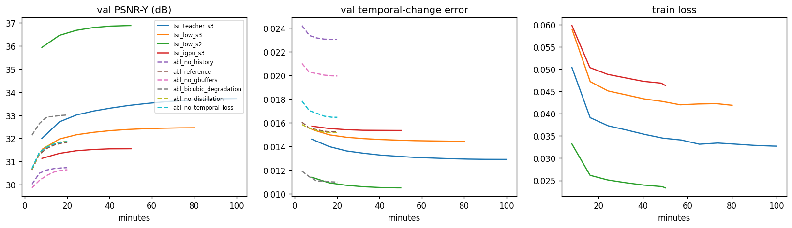

_Validation PSNR-Y, validation temporal-change error and train loss against minutes; dashed lines are ablations._

**Section 18: load and fuse.** Ten models loaded (teacher, three students, six ablations); fused FP32 parity 0.0 for every one.

**Section 19: test suites (1.7 min).** 24 synthetic test stills (6 per motion class), 8 TartanAir, 8 Sintel, 4 Vid4, 8 Vimeo-1080p and 4 GameIR native clips.

**Section 20: evaluation (5.8 min).** 12,560 per-frame metric rows (`test_per_frame.csv`): synthetic-game 5,760, TartanAir 1,920, Sintel 1,920, Vimeo-1080p 1,920, Vid4 960, GameIR native 80. The GameIR native suite ran this time (RAFT capped at 1024 px).

**Section 21: results by suite and method** (`test_results.csv`, mean over frames after the first). Higher is better for PSNR and SSIM; lower is better for LPIPS, temporal-change error (TCE) and tOF. Two defects of this run's evaluation are fixed in the current notebook (see [Project status](#project-status)): `bicubic` ignored the jitter, and the video suites (Vid4, Vimeo-1080p) used motion vectors estimated on jittered low-resolution frames.

3x:

| Suite          | Method        | PSNR-Y | SSIM-Y | PSNR disocc. | PSNR detail | LPIPS |    TCE |   tOF |
| :------------- | :------------ | -----: | -----: | -----------: | ----------: | ----: | -----: | ----: |
| synthetic-game | bicubic       |  27.40 |  0.782 |        32.26 |       21.45 | 0.294 | 0.0440 | 2.381 |
| synthetic-game | bilinear      |  29.81 |  0.833 |        34.47 |       23.88 | 0.273 | 0.0253 | 0.782 |
| synthetic-game | analytic_taau |  29.36 |  0.817 |        31.51 |       23.62 | 0.261 | 0.0110 | 0.790 |
| synthetic-game | igpu_s3       |  32.61 |  0.902 |        34.28 |       26.54 | 0.115 | 0.0124 | 0.698 |
| synthetic-game | student_s3    |  33.67 |  0.923 |        35.20 |       27.80 | 0.078 | 0.0110 | 0.501 |
| synthetic-game | teacher_s3    |  35.49 |  0.946 |        36.35 |       29.41 | 0.043 | 0.0086 | 0.451 |
| tartanair      | bicubic       |  29.59 |  0.864 |        29.14 |       22.68 | 0.220 | 0.0234 | 2.194 |
| tartanair      | bilinear      |  31.52 |  0.890 |        30.85 |       24.64 | 0.216 | 0.0132 | 0.485 |
| tartanair      | analytic_taau |  30.64 |  0.875 |        27.92 |       23.85 | 0.243 | 0.0104 | 0.415 |
| tartanair      | igpu_s3       |  32.88 |  0.920 |        29.65 |       26.06 | 0.110 | 0.0106 | 0.476 |
| tartanair      | student_s3    |  32.88 |  0.919 |        29.93 |       26.20 | 0.098 | 0.0109 | 0.394 |
| tartanair      | teacher_s3    |  33.44 |  0.931 |        30.30 |       26.66 | 0.070 | 0.0102 | 0.376 |
| sintel         | bicubic       |  30.60 |  0.839 |        28.52 |       24.54 | 0.280 | 0.0242 | 3.213 |
| sintel         | bilinear      |  32.55 |  0.874 |        30.49 |       26.61 | 0.269 | 0.0127 | 1.703 |
| sintel         | analytic_taau |  31.07 |  0.848 |        27.58 |       25.19 | 0.271 | 0.0092 | 1.519 |
| sintel         | igpu_s3       |  33.40 |  0.906 |        29.39 |       27.55 | 0.159 | 0.0099 | 1.543 |
| sintel         | student_s3    |  33.91 |  0.906 |        30.22 |       28.09 | 0.143 | 0.0102 | 1.406 |
| sintel         | teacher_s3    |  35.32 |  0.929 |        31.23 |       29.30 | 0.081 | 0.0090 | 1.253 |
| vid4           | bicubic       |  22.76 |  0.657 |        34.17 |       17.71 | 0.399 | 0.0813 | 2.299 |
| vid4           | bilinear      |  24.55 |  0.722 |        39.01 |       19.71 | 0.362 | 0.0577 | 0.397 |
| vid4           | analytic_taau |  23.17 |  0.635 |        34.37 |       18.50 | 0.362 | 0.0667 | 1.687 |
| vid4           | igpu_s3       |  23.85 |  0.713 |        36.69 |       18.74 | 0.208 | 0.0623 | 1.654 |
| vid4           | student_s3    |  23.66 |  0.689 |        36.31 |       18.70 | 0.244 | 0.0619 | 1.615 |
| vid4           | teacher_s3    |  24.32 |  0.729 |        39.46 |       19.24 | 0.200 | 0.0573 | 1.186 |
| vimeo1080p     | bicubic       |  43.30 |  0.943 |        51.24 |       37.13 | 0.100 | 0.0162 | 5.568 |
| vimeo1080p     | bilinear      |  45.83 |  0.957 |        54.55 |       39.86 | 0.104 | 0.0095 | 3.767 |
| vimeo1080p     | analytic_taau |  43.12 |  0.941 |        49.90 |       37.07 | 0.117 | 0.0138 | 5.977 |
| vimeo1080p     | igpu_s3       |  41.79 |  0.954 |        48.70 |       35.87 | 0.062 | 0.0108 | 8.477 |
| vimeo1080p     | student_s3    |  42.61 |  0.953 |        49.75 |       36.71 | 0.057 | 0.0100 | 7.451 |
| vimeo1080p     | teacher_s3    |  45.30 |  0.962 |        52.50 |       39.45 | 0.037 | 0.0086 | 6.637 |

Particle-region PSNR (synthetic-game only): bicubic 29.77, bilinear 33.13, analytic TAAU 29.64, `igpu` 33.63, student 34.04, teacher 36.84 dB. Warping error along exact motion (synthetic-game): teacher 0.0106, student 0.0123, analytic TAAU 0.0092, bilinear 0.0268.

2x (`low` 2x student against baselines; GameIR native uses the engine's own 720p render as input):

| Suite          | Method        | PSNR-Y | SSIM-Y | LPIPS |    TCE |   tOF |
| :------------- | :------------ | -----: | -----: | ----: | -----: | ----: |
| synthetic-game | bicubic       |  30.14 |  0.869 | 0.134 | 0.0339 | 1.575 |
| synthetic-game | bilinear      |  33.35 |  0.916 | 0.108 | 0.0172 | 0.430 |
| synthetic-game | analytic_taau |  30.85 |  0.871 | 0.193 | 0.0083 | 0.631 |
| synthetic-game | student_s2    |  38.45 |  0.971 | 0.023 | 0.0076 | 0.275 |
| tartanair      | bicubic       |  31.92 |  0.910 | 0.118 | 0.0180 | 1.476 |
| tartanair      | bilinear      |  33.98 |  0.931 | 0.121 | 0.0100 | 0.273 |
| tartanair      | analytic_taau |  31.44 |  0.896 | 0.212 | 0.0099 | 0.347 |
| tartanair      | student_s2    |  35.38 |  0.949 | 0.067 | 0.0092 | 0.344 |
| sintel         | bicubic       |  33.22 |  0.903 | 0.141 | 0.0179 | 2.038 |
| sintel         | bilinear      |  35.45 |  0.929 | 0.142 | 0.0083 | 0.897 |
| sintel         | analytic_taau |  31.70 |  0.875 | 0.220 | 0.0082 | 1.277 |
| sintel         | student_s2    |  38.58 |  0.965 | 0.043 | 0.0068 | 0.882 |
| vid4           | bicubic       |  25.60 |  0.800 | 0.205 | 0.0592 | 1.490 |
| vid4           | bilinear      |  27.78 |  0.854 | 0.191 | 0.0366 | 0.161 |
| vid4           | analytic_taau |  24.18 |  0.709 | 0.345 | 0.0544 | 1.270 |
| vid4           | student_s2    |  27.85 |  0.867 | 0.106 | 0.0383 | 0.516 |
| vimeo1080p     | bicubic       |  45.80 |  0.965 | 0.050 | 0.0119 | 3.592 |
| vimeo1080p     | bilinear      |  48.71 |  0.975 | 0.056 | 0.0062 | 3.357 |
| vimeo1080p     | analytic_taau |  43.97 |  0.953 | 0.101 | 0.0116 | 5.366 |
| vimeo1080p     | student_s2    |  48.20 |  0.981 | 0.015 | 0.0056 | 5.903 |
| gameir-native  | bicubic       |  32.33 |  0.912 | 0.169 | 0.0162 | 4.174 |
| gameir-native  | bilinear      |  32.30 |  0.907 | 0.190 | 0.0157 | 4.379 |
| gameir-native  | analytic_taau |  30.77 |  0.878 | 0.226 | 0.0165 | 4.822 |
| gameir-native  | student_s2    |  32.59 |  0.913 | 0.141 | 0.0153 | 4.260 |

What the numbers say:

- On suites with exact motion (synthetic, TartanAir, Sintel) the 3x student beats every baseline on PSNR-Y (by 2.2 to 4.3 dB over the analytic TAA upscaler) and LPIPS; the analytic TAA upscaler keeps a slightly lower temporal-change error on TartanAir and Sintel, and the two tie on synthetic scenes (0.0110). The teacher is best on PSNR-Y, SSIM-Y, LPIPS and temporal-change error on every exact-motion suite.
- The `igpu` student (21,196 fused parameters) matches the `low` student on TartanAir (32.88 dB) and is 1.1 dB behind on synthetic scenes.
- On the native GameIR renders (a real renderer's low-resolution image, not a simulated one) the 2x student is best on every metric except tOF, by 0.26 dB PSNR-Y over bicubic and with 17 percent lower LPIPS.
- On video, jitter-aware bilinear has the best 3x PSNR-Y. Part of this is the evaluation: one Vimeo-1080p clip (`723 Palisades Beach Rd.`) is blank, so every baseline scores the 100 dB cap on it while the student scores 78.2 and the teacher 88.9. Without it, 3x Vimeo-1080p reads bilinear 38.09, student 37.52, teacher 39.07, analytic TAAU 35.00 dB, and 2x reads student 43.17 against bilinear 41.38 dB. The other part is the jitter in the RAFT motion vectors; both are fixed in the current notebook.

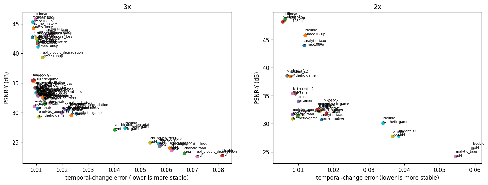

_PSNR-Y against temporal-change error per suite and method, 3x (left) and 2x (right); top-left is sharp and stable._

**Section 22: motion classes and regions (synthetic-game, 3x).** Measured motion per class: static 0.0, slow 2.65, medium 10.44, fast 17.62 output px per frame. PSNR-Y (dB):

| Method        | Static |  Slow | Medium |  Fast |
| :------------ | -----: | ----: | -----: | ----: |
| bicubic       |  24.66 | 27.84 |  23.63 | 33.48 |
| bilinear      |  26.72 | 30.37 |  25.56 | 36.58 |
| analytic_taau |  27.70 | 29.40 |  25.48 | 34.85 |
| igpu_s3       |  31.09 | 32.83 |  27.52 | 39.01 |
| student_s3    |  32.74 | 33.89 |  28.32 | 39.73 |
| teacher_s3    |  34.65 | 36.38 |  29.42 | 41.53 |

The fast class scores higher than medium for every method, including bicubic, so the classes also differ in texture content; compare methods within a class, not classes with each other.

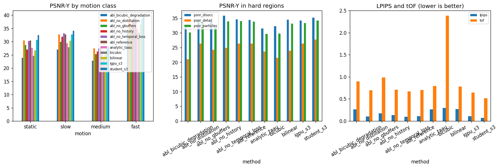

_PSNR-Y by motion class, PSNR-Y inside disocclusions, fine detail and particles, and LPIPS / tOF per method._

**Section 23: static-scene convergence** (`static_convergence.csv`, 16 frames, static camera with sub-pixel jitter):

| Method         | Last-frame PSNR-Y (dB) | Last-frame FLIP |
| :------------- | ---------------------: | --------------: |
| bilinear       |                  27.29 |          0.0679 |
| analytic_taau  |                  28.42 |          0.0621 |
| student_s3     |                  35.30 |          0.0289 |
| igpu_s3        |                  32.72 |          0.0337 |
| teacher_s3     |                  38.50 |          0.0189 |
| abl_no_history |                  28.10 |          0.0545 |

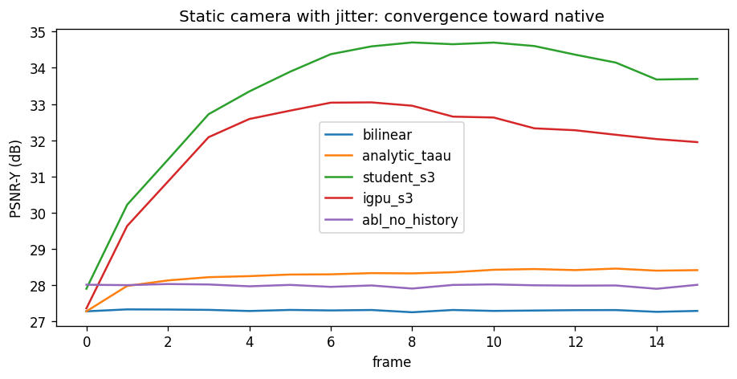

_PSNR-Y against frame index with a static camera: the recurrent models accumulate detail, single-frame methods stay flat._

**Section 24: visual comparisons.** Full last frames per method are saved in `predictions/`.

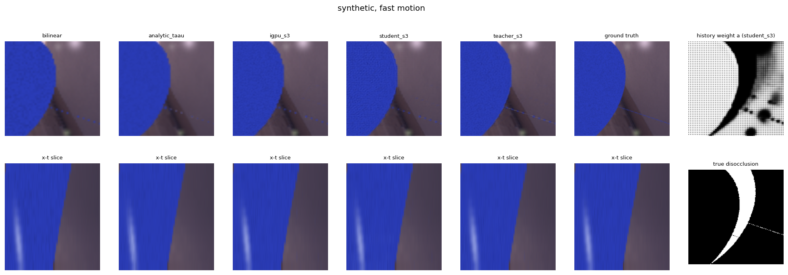

_Fast-motion synthetic sequence: last-frame crops per method, the student's history weight, x-t slices and the true disocclusion mask. The history weight drops to zero in and around the true disocclusion. On the flat blue surface the student's output shows a fine dot pattern that the teacher's shows much less._

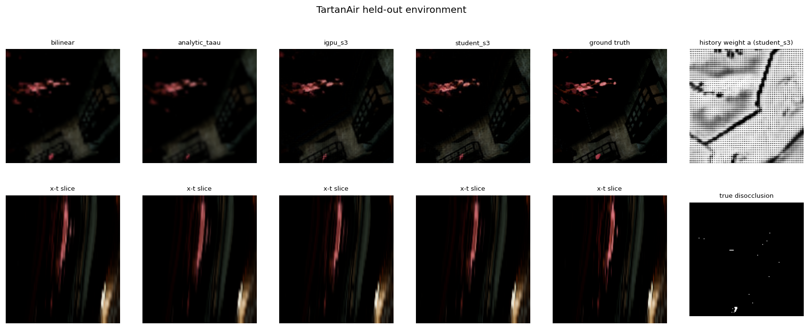

_TartanAir held-out environment: the networks recover the window frames and railings that bilinear and analytic TAAU blur. The student's history weight varies with the 3x sub-pixel phase (a dot grid), and a faint grid of the same period is visible in dark areas of the student's output._

| Prediction frame | Synthetic fast motion                                                                     | TartanAir                                                                            |
| :--------------- | :---------------------------------------------------------------------------------------- | :----------------------------------------------------------------------------------- |
| Ground truth     | 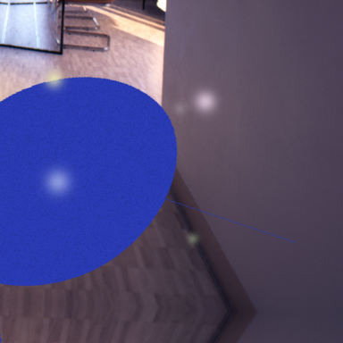    |     |
| Bilinear         |   | 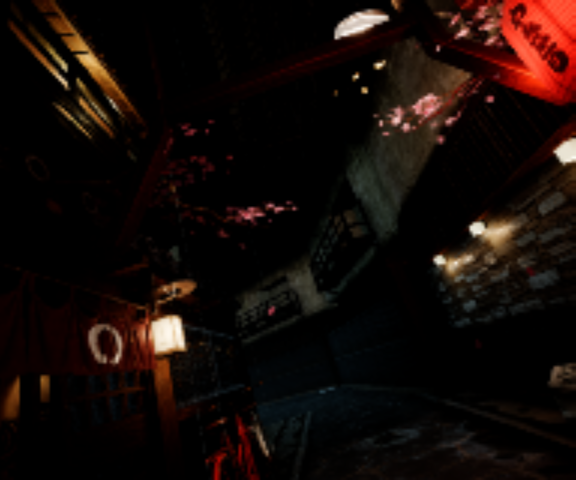  |
| Analytic TAAU    | 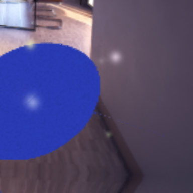 |  |
| `igpu` 3x        | 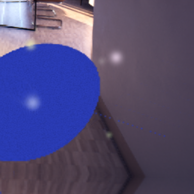       |        |
| `low` 3x student |  |  |
| 3x teacher       |  |  |

**Section 25: ablations** (`ablations.csv`, `low` 3x, 20 minutes each). Delta to `abl_reference`:

| Ablation            | Synthetic PSNR-Y | Synthetic TCE | TartanAir PSNR-Y | TartanAir TCE | TartanAir PSNR disocc. |
| :------------------ | ---------------: | ------------: | ---------------: | ------------: | ---------------------: |
| no history          |           -1.986 |        +0.010 |           -0.730 |        +0.002 |                 +1.214 |
| no G-buffers        |           -2.212 |        +0.009 |           -1.356 |        +0.005 |                 +0.884 |
| bicubic degradation |           -5.724 |        +0.028 |           -2.990 |        +0.009 |                 -0.245 |
| no temporal loss    |           -0.109 |        +0.002 |           +0.158 |        +0.000 |                 +0.119 |
| no distillation     |           +0.108 |        +0.000 |           -0.051 |        +0.000 |                 -0.090 |

Reference absolute values: synthetic-game 32.83 dB, TCE 0.0122; TartanAir 33.01 dB, TCE 0.0105. Render-like jittered training (against bicubic) matters most, then G-buffers, then history. Without history the network does better inside disocclusions (no stale history to reject) but worse overall. The no-temporal-loss run is slightly less stable on synthetic scenes. Distillation from the now-working teacher still has no measurable effect within 20 minutes; with equal wall-clock budgets the run without a teacher also made 27 percent more steps (1,380 against 1,090).

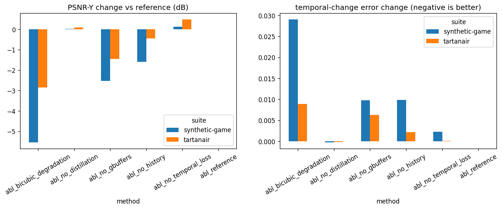

_PSNR-Y change and temporal-change error change against the reference per ablation and suite._

**Section 26: latency** (`latency.csv`, fused FP16 step, batch 1, PyTorch eager on one T4; the estimate columns assume a sustained FP16 throughput and are not measurements):

| Model      | Scale | Output    | T4 mean (ms) | T4 p95 (ms) |   GMAC | Estimate at 4 TFLOPS (ms) | Estimate at 8 TFLOPS (ms) |
| :--------- | ----: | :-------- | -----------: | ----------: | -----: | ------------------------: | ------------------------: |
| igpu_s3    |     3 | 1920x1080 |        10.05 |       10.15 |   4.84 |                      2.42 |                      1.21 |
| igpu_s3    |     3 | 3840x2160 |        39.81 |       40.16 |  19.36 |                      9.68 |                      4.84 |
| student_s3 |     3 | 1920x1080 |        13.93 |       14.09 |  12.91 |                      6.46 |                      3.23 |
| student_s3 |     3 | 3840x2160 |        55.77 |       56.54 |  51.64 |                     25.82 |                     12.91 |
| student_s2 |     2 | 1920x1080 |        24.06 |       24.41 |  25.12 |                     12.56 |                      6.28 |
| teacher_s3 |     3 | 1920x1080 |        43.84 |       44.95 | 144.42 |                     72.21 |                     36.10 |
| teacher_s3 |     3 | 3840x2160 |       184.59 |      189.78 | 577.68 |                    288.84 |                    144.42 |

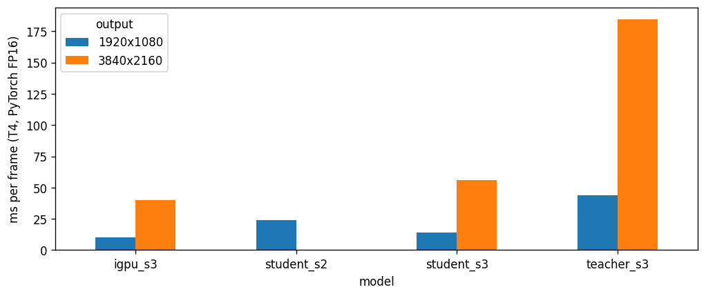

_Mean T4 milliseconds per frame for each model and output size._

**Section 27: ONNX export** (`onnx_export.json`, opset 17, static shapes): `student_s3` 0.450 MB, ONNX Runtime max difference 4.77e-7; `igpu_s3` 0.136 MB, 5.96e-7.

**Section 28: summary** (`summary.json`, `stage_times.csv`). Stage minutes: manifest 0.03, caches 19.56, batch probe 0.45, teacher 100.23, student 80.28, pair 50.25, ablations 60.51, test suites 1.73, evaluation 5.84.

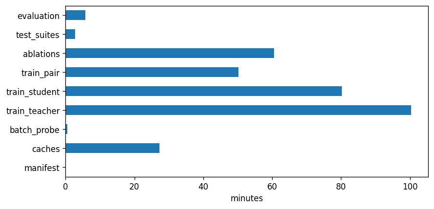

_Minutes per stage of the TSR run._

**Sections 29 and 30.** Deleted 9.30 GB of caches and zipped 126 files (0.06 GB) into `outputs.zip`.

## Notebook 3: frame generation

Run of 20 to 21 October 2026 (PyTorch 2.0.0, CUDA 11.8, Python 3.10.12, 2 x Tesla T4, 4 CPU cores, 31.3 GB RAM; 4.93 hours; no failed runs). Outputs: [neural-frame-generation/outputs/](neural-frame-generation/outputs/); executed notebook: [neural-frame-generation.executed.ipynb](neural-frame-generation/outputs/neural-frame-generation.executed.ipynb). The numbers below are from the run; the current notebook adds the fixes listed under [Project status](#project-status).

**Sections 1 to 4: library, setup, hardware, configuration.** All three optional packages installed. Settings: 192-px patches, 40 percent real quads, 50 percent extrapolation, HUD in 50 percent of synthetic samples, menus 3, cuts 3 and camera reversals 10 percent; loss weights census 0.5, LPIPS 0.1, flow 0.01, UI 0.2, distillation 0.5. Budgets in this run: teacher 70, student 80, pair 50, ablations 20 min (the current notebook uses 100, 120, 75 and 20).

**Sections 5 and 6: manifest and items.** Same manifest as the TSR run (all sources reachable). 4,083 texture and 5,080 quad items for training, 252 and 850 for validation. GameIR is not used (its frames are 10 rendered frames apart).

**Section 7: caches (27.9 min, 10.22 GB).** 256 validation and 5,682 training still crops (1 decode failure; the stills' share of the cache budget ended at 5,682 of 6,000), 256 validation and 6,000 training quads, all with RAFT flows. Training quads: Vimeo-90K 5,493, REDS 252, Vimeo-1080p 142, TartanAir 70, Sintel 43; validation quads: Vimeo-90K 251, REDS 5.

**Section 8: synthetic preview.**

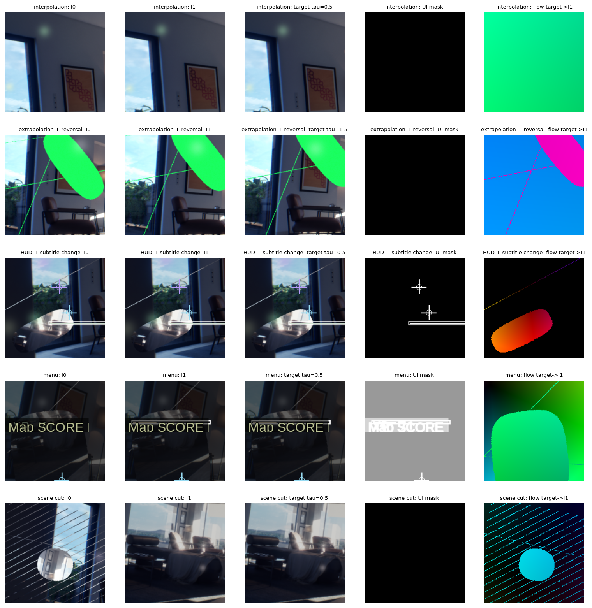

_Interpolation, extrapolation with a camera reversal, HUD with a subtitle change, a menu and a scene cut: I0, I1, target, UI mask and exact target-to-I1 flow._

**Section 9: model tiers** (`model_tiers.csv`, parity 0.0 for every tier):

| Tier    | Train params | Fused params | GMAC per 1080p frame (network only) |
| :------ | -----------: | -----------: | ----------------------------------: |
| igpu    |       16,953 |       12,089 |                                1.55 |
| low     |       40,497 |       28,545 |                                3.67 |
| mid     |      134,610 |       94,546 |                               30.42 |
| high    |      342,066 |      238,770 |                               76.98 |
| teacher |      701,202 |      487,954 |                              157.51 |

**Section 10: batch probe.** Every size up to 96 fit; 96 per GPU was chosen (`batch_probe.csv`).

| Batch | Teacher VRAM % | Teacher samples/s | Student + teacher VRAM % | Student samples/s |
| ----: | -------------: | ----------------: | -----------------------: | ----------------: |
|     8 |            6.6 |              47.0 |                      5.4 |              56.4 |
|    16 |           11.9 |              60.7 |                      9.6 |              65.2 |
|    24 |           17.4 |              64.3 |                     13.9 |              69.8 |
|    32 |           22.8 |              64.8 |                     18.1 |              71.1 |
|    48 |           33.6 |              65.6 |                     26.6 |              71.9 |
|    64 |           44.5 |              65.7 |                     35.3 |              72.3 |
|    96 |           66.0 |              65.7 |                     52.2 |              72.6 |

**Sections 11 to 15: training** (budgets at full scale).

| Stage             | Run                                      |        Steps |      Train s | Best val PSNR (round) |
| :---------------- | :--------------------------------------- | -----------: | -----------: | :-------------------- |
| A, both GPUs      | `fg_teacher` (privileged)                |        3,180 |        4,201 | 33.59 dB (8)          |
| B, both GPUs      | `fg_low`                                 |        4,180 |        4,809 | 26.88 dB (9)          |
| C, GPU 0 / GPU 1  | `fg_igpu`, `fg_mid`                      | 2,610, 4,660 | 3,002, 3,003 | 26.51 (6), 27.39 (6)  |
| Ablations, pair 1 | `abl_reference`, `abl_no_ui_training`    | 1,040, 1,190 | 1,207, 1,205 | 26.38 (5), 28.61 (5)  |
| Ablations, pair 2 | `abl_no_motion_prior`, `abl_interp_only` | 1,050, 1,050 | 1,211, 1,211 | 24.39 (5), 28.10 (4)  |
| Ablations, pair 3 | `abl_extrap_only`, `abl_no_distillation` | 1,040, 1,170 | 1,209, 1,210 | 25.58 (4), 26.25 (5)  |

**Section 16: training curves** (`best_validation.csv`, `history_<run>.csv`):

| Run          | Val PSNR per round (dB)                                              | Interp / extrap / UI at best | Train loss first to last | Peak memory (GB) |
| :----------- | :------------------------------------------------------------------- | :--------------------------- | :----------------------- | ---------------: |
| `fg_teacher` | 30.26, 31.76, 32.55, 32.96, 33.26, 33.43, 33.53, 33.57, 33.59        | 34.09 / 33.10 / 32.93        | 0.1820 to 0.0533         |             9.22 |
| `fg_low`     | 26.14, 26.36, 26.69, 26.76, 26.80, 26.83, 26.85, 26.86, 26.86, 26.88 | 28.00 / 25.79 / 27.32        | 0.1930 to 0.1068         |             7.21 |
| `fg_mid`     | 26.65, 27.08, 27.23, 27.33, 27.38, 27.39, 27.39                      | 28.63 / 26.20 / 30.25        | 0.1809 to 0.0937         |             4.05 |
| `fg_igpu`    | 26.00, 26.18, 26.30, 26.46, 26.50, 26.51, 26.51                      | 27.46 / 25.59 / 25.88        | 0.2073 to 0.1210         |             7.16 |

As for TSR, each ablation validates on its own recipe (for example `abl_no_ui_training` has no UI in its validation batches), so ablation validation scores are not comparable.

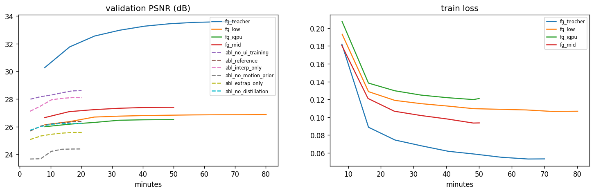

_Validation PSNR and train loss against minutes for every run._

**Section 17: load and fuse.** Ten models fused to FP16 (teacher, student, `igpu`, `mid`, six ablations).

**Section 18: cut detector** (`cut_detector.json`): threshold 0.1825 for 1 percent false alarms on continuous synthetic pairs; detection rate 1.0.

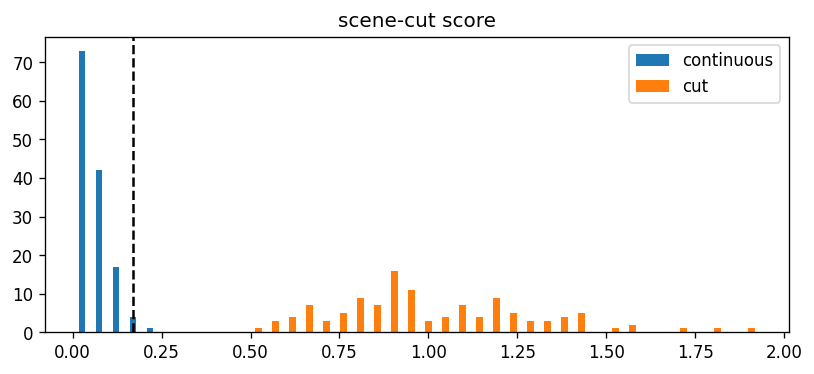

_Scene-cut score for continuous and cut pairs, with the chosen threshold._

**Section 19: test suites (2.3 min).** 48 synthetic test stills; 48 Vimeo-90K triplets, 10 TartanAir, 10 Sintel, 12 Vimeo-1080p and 4 Vid4 clips.

**Section 20: evaluation (1.3 min).** 11,928 metric rows (`test_per_sample.csv`). TartanAir and Sintel feed the exact motion vector of I1 (frame 2 to 1 composed with 1 to 0); the video suites use RAFT.

**Section 21: results by suite, mode and method** (`test_results.csv`). The privileged teacher sees the target frame, so it is an upper bound, not a deployable model. PSNR in dB:

| Suite         | Mode   | Repeat | Average | MV reprojection | `igpu` | `low` student | `mid` | Teacher |
| :------------ | :----- | -----: | ------: | --------------: | -----: | ------------: | ----: | ------: |
| vimeo_triplet | interp |  23.06 |   26.03 |           31.83 |  32.48 |         32.85 | 33.19 |   39.21 |
| tartanair     | interp |  18.84 |   20.81 |           27.98 |  28.77 |         29.21 | 29.17 |   34.05 |
| tartanair     | extrap |  18.88 |   18.71 |           26.91 |  26.83 |         26.72 | 26.73 |   32.62 |
| sintel        | interp |  20.93 |   22.87 |           24.46 |  24.40 |         24.41 | 24.61 |   31.00 |
| sintel        | extrap |  20.95 |   20.50 |           23.29 |  23.08 |         23.06 | 23.06 |   29.87 |
| vid4          | interp |  20.69 |   24.09 |           27.35 |  27.76 |         27.88 | 27.88 |   31.77 |
| vid4          | extrap |  21.41 |   19.73 |           25.89 |  25.87 |         25.79 | 25.82 |   31.03 |
| vimeo1080p    | interp |  41.20 |   43.94 |           44.43 |  44.77 |         44.88 | 40.52 |   43.21 |
| vimeo1080p    | extrap |  43.12 |   40.34 |           43.80 |  44.74 |         44.98 | 42.44 |   43.81 |
| synthetic     | interp |  28.10 |   33.85 |           34.87 |  35.43 |         35.63 | 35.43 |   39.59 |
| synthetic     | extrap |  28.08 |   25.66 |           30.86 |  31.85 |         31.88 | 31.69 |   37.11 |

The Vimeo-1080p rows are distorted by three of the twelve clips: two are blank, so repeat, average and reprojection reach the 100 dB cap while `mid` scores 74 to 86 and the teacher 71 to 72 dB, and one has a cut inside its four frames (9.9 dB for every method). Without them (9 clips, from `test_per_sample.csv`): interpolation repeat 31.61, average 34.59, MV reprojection 35.92, `igpu` 36.37, student 36.52, `mid` 36.41, teacher 40.67 dB; extrapolation 31.91, 29.81, 33.49, 34.33, 34.38, 34.18, 39.06 dB. The current notebook skips such clips.

SSIM / LPIPS / interpolation error (lower is better) for the `low` student on Vimeo-90K triplet: 0.948 / 0.042 / 7.00 (MV reprojection 0.946 / 0.041 / 7.78). Occluded-region PSNR, student against MV reprojection: Vimeo-90K triplet 24.91 vs 23.43, TartanAir interpolation 32.56 vs 28.76, synthetic interpolation 25.19 vs 20.44 dB.

What the numbers say: interpolation beats motion-vector reprojection on Vimeo-90K triplet (+1.0 dB), TartanAir (+1.2), Vid4 (+0.5), synthetic scenes (+0.8) and Vimeo-1080p without the defective clips (+0.6), and is level on Sintel (-0.05). With exact engine motion vectors, extrapolation does not beat reprojection on TartanAir (-0.2 dB), Sintel (-0.2) or Vid4 (-0.1); it beats it on synthetic scenes (+1.0) and Vimeo-1080p.

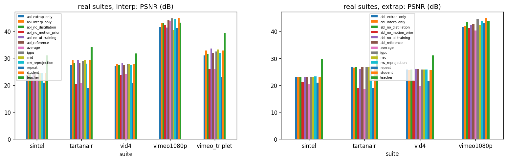

_PSNR per method on the real suites, interpolation (left) and extrapolation (right)._

**Section 22: motion, UI, menus, cuts and reversals.** Measured motion between real frames: static 0.0, slow 1.72, medium 6.65, fast 18.62 px. Synthetic PSNR by motion class (dB):

| Mode   | Method          | Static |  Slow | Medium |  Fast |
| :----- | :-------------- | -----: | ----: | -----: | ----: |
| interp | repeat          |  45.95 | 27.82 |  21.49 | 17.14 |
| interp | MV reprojection |  53.78 | 33.76 |  28.56 | 23.36 |
| interp | `igpu`          |  53.13 | 35.14 |  30.07 | 23.38 |
| interp | student         |  52.99 | 35.21 |  30.44 | 23.89 |
| interp | `mid`           |  50.42 | 35.94 |  31.43 | 23.92 |
| interp | teacher         |  54.50 | 38.68 |  36.64 | 28.53 |
| extrap | repeat          |  45.96 | 27.79 |  21.49 | 17.08 |
| extrap | MV reprojection |  42.07 | 31.94 |  27.21 | 22.20 |
| extrap | `igpu`          |  45.32 | 32.85 |  27.77 | 21.47 |
| extrap | student         |  45.49 | 32.87 |  27.75 | 21.41 |
| extrap | `mid`           |  44.72 | 32.97 |  27.73 | 21.35 |
| extrap | teacher         |  51.68 | 37.09 |  33.79 | 25.86 |

UI suite (`ui_results.csv`; ghosting = share of UI pixels off by more than 10 percent):

| Mode   | Method           |  PSNR | UI PSNR | UI ghosting rate |
| :----- | :--------------- | ----: | ------: | ---------------: |
| interp | repeat           | 25.28 |   44.73 |            0.030 |
| interp | average          | 24.43 |   28.02 |            0.296 |
| interp | MV reprojection  | 21.58 |   14.99 |            0.336 |
| interp | `igpu`           | 27.35 |   30.60 |            0.077 |
| interp | student          | 27.85 |   31.69 |            0.063 |
| interp | `mid`            | 28.62 |   34.81 |            0.041 |
| interp | student+ui_layer | 29.47 |   48.74 |            0.025 |
| interp | `igpu`+ui_layer  | 29.54 |   49.13 |            0.025 |
| interp | teacher          | 31.52 |   36.37 |            0.034 |
| extrap | repeat           | 25.96 |   54.50 |            0.020 |
| extrap | average          | 22.37 |   38.81 |            0.255 |
| extrap | MV reprojection  | 22.78 |   15.49 |            0.391 |
| extrap | `igpu`           | 27.85 |   30.86 |            0.094 |
| extrap | student          | 28.17 |   32.50 |            0.068 |
| extrap | `mid`            | 28.44 |   34.48 |            0.051 |
| extrap | student+ui_layer | 29.19 |   56.73 |            0.012 |
| extrap | `igpu`+ui_layer  | 29.18 |   56.68 |            0.012 |
| extrap | teacher          | 31.59 |   36.27 |            0.032 |

Menus: interpolation student 35.17 dB, student with the UI layer 38.69, `mid` 35.30, repeat 33.11, MV reprojection 23.23; extrapolation student 35.44, with the UI layer 37.88, repeat 34.57. Cuts: every gated network outputs the newest real frame, so its PSNR is capped at 100 dB, against 25.61 (interpolation) and 24.50 (extrapolation) for MV reprojection and about 14.8 for averaging. Camera reversal (extrapolation): student 23.91 dB with and without the camera prior, `igpu` 23.96 / 23.95, teacher 30.76 / 30.78, frame repeat 24.86, MV reprojection 23.55, and the no-motion-prior ablation 25.01; the camera prior makes no measurable difference (see [Known limitations](#known-limitations)).

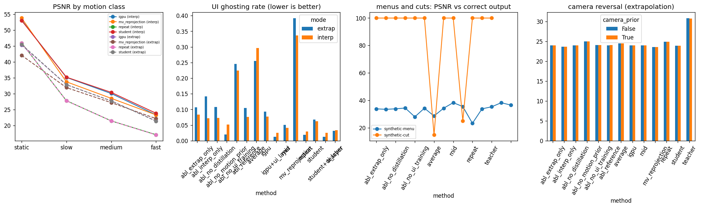

_PSNR by motion class, UI ghosting rate per method, menu and cut correctness, and camera reversal with and without the camera prior._

**Section 23: temporal consistency of the displayed sequence** (`temporal_consistency.csv`, tOF in px, lower is better):

| Suite         | Average | MV reprojection | `igpu` | Student |  `mid` |
| :------------ | ------: | --------------: | -----: | ------: | -----: |
| tartanair     |   8.282 |           0.750 |  0.950 |   0.838 |  0.784 |
| vimeo1080p    |  14.037 |          14.358 | 15.956 |  17.074 | 19.451 |
| vimeo_triplet |   1.774 |           0.306 |  0.332 |   0.316 |  0.311 |

MV reprojection is the most temporally consistent method on all three suites. The Vimeo-1080p values are inflated by the blank clips, on which RAFT reports 27.8 px of motion between identical frames.

**Section 24: visual comparisons.**

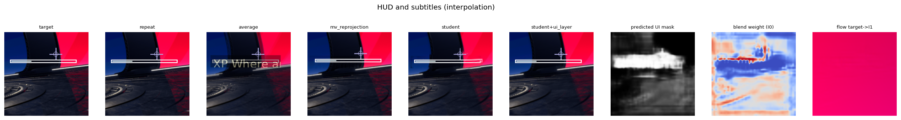

_HUD and subtitle sample (interpolation): averaging shows a half-faded subtitle and MV reprojection drags the HUD bar, while the student's predicted UI mask covers the HUD so it is copied from the newest real frame._

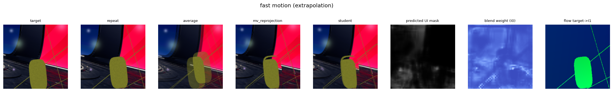

_Fast-motion extrapolation: target, baselines, student output, UI mask, blend weight and predicted flow. Both MV reprojection and the student leave a sliver of the moving object behind at its upper edge, where the background is disoccluded._

This run saved no frames to `predictions/`; the current notebook saves every panel there.

**Section 25: ablations** (`ablations.csv`, `low` tier, 20 minutes each). PSNR in dB:

| Ablation        | Vimeo-90K triplet interp | TartanAir interp | TartanAir extrap | Synthetic interp | Synthetic extrap | UI ghosting interp |
| :-------------- | -----------------------: | ---------------: | ---------------: | ---------------: | ---------------: | -----------------: |
| reference       |                    31.99 |            28.23 |            26.81 |            33.36 |            31.62 |              0.077 |
| no UI training  |                    33.58 |            29.29 |            26.11 |            36.60 |            32.09 |              0.224 |
| no motion prior |                    25.92 |            20.34 |            19.03 |            31.68 |            27.37 |              0.052 |
| interp only     |                    32.81 |            29.26 |            26.58 |            35.90 |            30.19 |              0.072 |
| extrap only     |                    31.00 |            27.48 |            26.80 |            32.16 |            31.94 |              0.084 |
| no distillation |                    31.61 |            28.06 |            26.86 |            32.98 |            31.60 |              0.073 |

Engine motion vectors are the most valuable input (6.1 to 7.9 dB on real suites). Training with UI costs 1.6 dB on Vimeo-90K triplet and 3.2 dB on synthetic interpolation without UI, but is what keeps UI ghosting low (0.077 against 0.224); the no-motion-prior model's low ghosting comes from barely moving anything (it also has the best camera-reversal score, close to frame repeat). One model for both modes costs 0.8 dB of interpolation quality on Vimeo-90K triplet against an interpolation-only model. Distillation from the privileged teacher now gives a small gain on interpolation (+0.38 dB on Vimeo-90K triplet and synthetic, +0.17 dB on TartanAir) although the run without a teacher made 12 percent more steps (1,170 against 1,040).

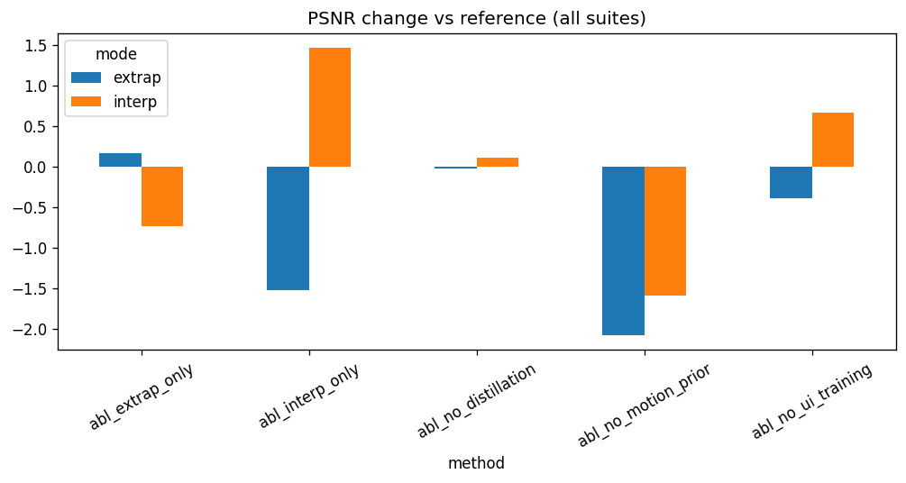

_PSNR change against the reference per ablation, interpolation and extrapolation, all suites._

**Section 26: latency and pacing model** (`latency.csv`, `pacing_model.csv`). T4 eager PyTorch, fused FP16, batch 1:

| Model   | Output    | T4 mean (ms) | T4 p95 (ms) |  GMAC | Estimate at 4 TFLOPS (ms) |
| :------ | :-------- | -----------: | ----------: | ----: | ------------------------: |
| igpu    | 1920x1080 |        15.59 |       16.03 |  1.55 |                      0.78 |
| igpu    | 2560x1440 |        27.15 |       27.29 |  2.76 |                      1.38 |
| student | 1920x1080 |        16.52 |       16.64 |  3.67 |                      1.84 |
| student | 2560x1440 |        28.99 |       29.20 |  6.52 |                      3.26 |
| mid     | 1920x1080 |        38.54 |       39.35 | 30.42 |                     15.21 |
| mid     | 2560x1440 |        68.86 |       69.62 | 54.08 |                     27.04 |

The pacing model is a simulation (`nss_metrics.simulate_latency`), driven by the measured 16.52 ms student time:

| Base render (ms) | Mode        | Displayed fps | Game latency (ms) | Camera latency (ms) | Content age (ms) |
| ---------------: | :---------- | ------------: | ----------------: | ------------------: | ---------------: |
|             33.3 | native      |         30.01 |             38.33 |               38.33 |            38.33 |
|             33.3 | interp      |         40.13 |             79.77 |               54.85 |            67.31 |
|             33.3 | extrap      |         40.13 |             38.33 |               50.79 |            50.79 |
|             33.3 | extrap_late |         40.13 |             38.33 |               27.92 |            50.79 |
|             25.0 | native      |         39.97 |             30.02 |               30.02 |            30.02 |
|             25.0 | interp      |         48.15 |             67.31 |               46.54 |            56.93 |
|             25.0 | extrap      |         48.15 |             30.02 |               40.41 |            40.41 |
|             25.0 | extrap_late |         48.15 |             30.02 |               23.77 |            40.41 |
|             16.7 | native      |         59.84 |             21.72 |               21.72 |            21.72 |
|             16.7 | interp      |         60.19 |             54.85 |               38.23 |            46.54 |
|             16.7 | extrap      |         60.19 |             21.72 |               30.02 |            30.02 |
|             16.7 | extrap_late |         60.19 |             21.72 |               19.62 |            30.02 |

With a 16.5 ms generation time on the same GPU the displayed rate rises only to 40 fps from a 30 fps base, and interpolation multiplies game latency by 2.1 to 2.5; extrapolation keeps native game latency, and late-latched extrapolation has the lowest camera latency.

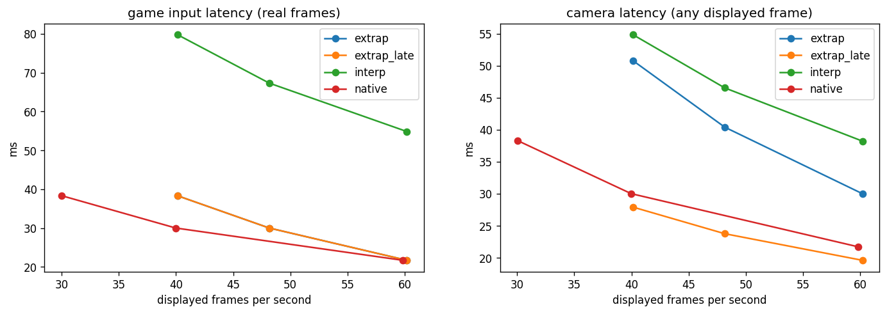

_Displayed frame rate against game input latency (left) and camera latency (right) for each mode and base render time._

**Section 27: ONNX export** (`onnx_export.json`): student 0.327 MB, ONNX Runtime max difference 4.41e-6; `igpu` 0.261 MB, 3.10e-6.

**Section 28: summary** (`summary.json`, `stage_times.csv`). Stage minutes: manifest 0.07, caches 27.90, batch probe 0.48, teacher 70.31, student 80.36, pair 50.15, ablations 60.77, test suites 2.31, evaluation 1.30. The summary lists `null` for Vimeo-90K triplet extrapolation, which does not exist; the current notebook leaves those keys out.

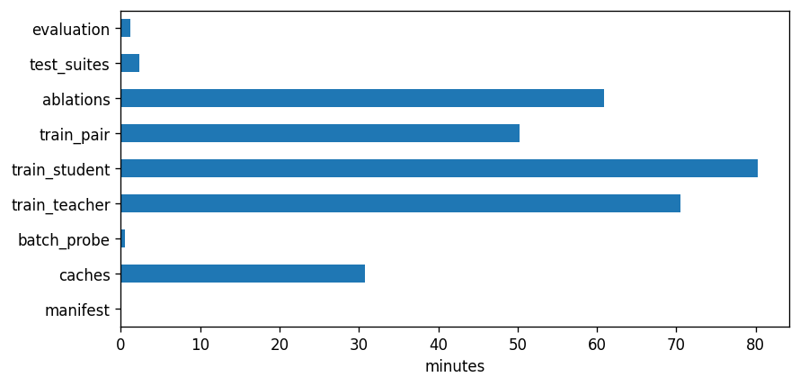

_Minutes per stage of the FG run._

**Sections 29 and 30.** Deleted 10.22 GB of caches and zipped 114 files (0.02 GB) into `outputs.zip`.

## Weights and exported models

Each training run saved three PyTorch checkpoints in its notebook's `outputs/weights/`: `<run>_best.pt` (EMA weights of the best validation round), `<run>_last.pt` (model and EMA weights of the last round) and `<run>_fused.pt` (RepConv folded into plain convolutions, FP16). They are research weights trained on research-use data (see [RESEARCH.md](RESEARCH.md) section 16). All are from the runs of 20 to 21 October 2026.

| File                                                             | Size (best / last / fused)      | Purpose                                                    |
| :--------------------------------------------------------------- | :------------------------------ | :--------------------------------------------------------- |
| `neural-supersampling/outputs/weights/tsr_low_s3_*.pt`           | 538 / 1,074 / 203 KB            | Main 3x TSR student                                        |
| `neural-supersampling/outputs/weights/tsr_igpu_s3_*.pt`          | 122 / 241 / 47 KB               | Integrated-GPU 3x TSR student                              |
| `neural-supersampling/outputs/weights/tsr_low_s2_*.pt`           | 503 / 1,004 / 188 KB            | 2x TSR student                                             |
| `neural-supersampling/outputs/weights/tsr_teacher_s3_*.pt`       | 7,544 / 15,086 / 2,701 KB       | 3x TSR teacher (distillation source)                       |
| `neural-supersampling/outputs/weights/abl_*`                     | about 538 / 1,075 / 203 KB each | Six TSR ablation runs                                      |
| `neural-supersampling/outputs/weights/tsr_student_s3_fused.onnx` | 440 KB                          | ONNX, one recurrent step of the 3x student, 64x36 input    |
| `neural-supersampling/outputs/weights/tsr_igpu_s3_fused.onnx`    | 133 KB                          | ONNX, one recurrent step of the `igpu` student             |
| `neural-frame-generation/outputs/weights/fg_low_*.pt`            | 172 / 342 / 61 KB               | Main FG student                                            |
| `neural-frame-generation/outputs/weights/fg_igpu_*.pt`           | 78 / 155 / 28 KB                | Integrated-GPU FG student                                  |
| `neural-frame-generation/outputs/weights/fg_mid_*.pt`            | 553 / 1,105 / 197 KB            | Two-level FG model                                         |
| `neural-frame-generation/outputs/weights/fg_teacher_*.pt`        | 2,776 / 5,552 / 969 KB          | Privileged teacher (needs the target frame; training only) |
| `neural-frame-generation/outputs/weights/abl_*`                  | about 172 / 343 / 62 KB each    | Six FG ablation runs                                       |
| `neural-frame-generation/outputs/weights/fg_student_fused.onnx`  | 319 KB                          | ONNX, FG student, 96x64 input                              |
| `neural-frame-generation/outputs/weights/fg_igpu_fused.onnx`     | 255 KB                          | ONNX, FG `igpu`                                            |

The ONNX files use static shapes (the small export size); re-export at the target resolution with `nss_models.export_onnx` for deployment. The changes made after the runs touch only evaluation and training budgets, not the model definitions, so these weights load into the current models.

## Known limitations

A full list with reasons is in [RESEARCH.md](RESEARCH.md) section 15. The most important ones, from the runs:

- **The fixes made after the runs are not measured yet.** The jitter-aware bicubic baseline, RAFT motion from full-resolution frames on video, the test-clip filter and the longer budgets all change the numbers above; only a new Kaggle run shows by how much.
- **On video with estimated motion, the 3x TSR students do not yet beat a jitter-aware bilinear upsample on PSNR-Y** (Vid4, and Vimeo-1080p even without the blank clip), although their LPIPS is lower; the 2x student does, and the 3x teacher does on Vimeo-1080p without the blank clip.
- **The 3x student shows a faint dot pattern at the pixel-shuffle period** on flat and dark areas (section 24 of the TSR notebook); the teacher shows much less of it.
- **The FG camera prior is unused.** `FGNet.priors` replaces the linear-motion flow with the camera flow only when no motion vector is available; with motion vectors, the network learned to ignore the camera channel, so late latching does not improve camera reversals (frame repeat is better there).
- **With exact engine motion vectors, FG extrapolation does not beat plain motion-vector reprojection** on TartanAir, Sintel or Vid4, and reprojection is more temporally consistent (tOF) than the networks on all three suites where it is measured.
- **Distillation is weak.** TSR distillation from the trained teacher gave no measurable gain in 20-minute ablations; FG distillation gave 0.2 to 0.4 dB on interpolation.
- **T4 latencies are PyTorch eager timings**, 2.5x to 20x the arithmetic estimates for FG; in-engine latency on target GPUs is `Not measured in the current repository.`
- **Validation is not comparable across ablations**, and TSR validation has no exact-motion source (TartanAir and Sintel have no validation items).
- **Real training data is mostly Vimeo-90K** (about 91 percent of real training windows and quads), and only about 2 percent of TSR windows have exact motion.
- **No comparison with FSR, DLSS or XeSS** yet; it needs engine captures.

## Troubleshooting

| Problem                                                                     | Likely cause                                                          | Diagnostic                                                                       | Resolution                                                                                                |
| :-------------------------------------------------------------------------- | :-------------------------------------------------------------------- | :------------------------------------------------------------------------------- | :-------------------------------------------------------------------------------------------------------- |
| `build_notebooks.py --check` lists a stale notebook                         | A file in `src/neuralss/` or `notebooks/` changed without a rebuild   | `.venv\Scripts\python tools\build_notebooks.py --check`                          | Run `tools\build_notebooks.py`; copy an executed notebook to `outputs/` first if its outputs must be kept |
| A training run is listed in `metrics/failed_runs.json`                      | Out of memory twice, a non-finite loss for 200 steps, or a crash      | Read `outputs/logs/<run>.log` (and `<run>.oom.log` after an out-of-memory retry) | Lower the batch, check the loss terms; later stages continue without that run                             |
| A run is killed past its budget                                             | Hung data-loader worker or NCCL collective                            | The run log ends with a timeout line from the watchdog                           | Re-run; reduce `workers_per_rank` in `run_cfg` if it repeats                                              |
| `evaluation <suite> / <method> skipped` in the notebook log                 | That method failed on that suite (for example out of memory)          | `outputs/logs/notebook.log`                                                      | Other methods and suites still run; the skipped rows are missing from `test_per_frame.csv`                |
| `<source> <item>: skipped (blank)` (or `frozen`, `cut`) in the notebook log | The test clip cannot measure the method (see `nss_eval.clip_defects`) | `outputs/logs/notebook.log`                                                      | Expected; the suite loads the next clip of that source (at most 4 n clips are tried)                      |
| Sources left out after the manifest cell                                    | Their Kaggle dataset is not attached or did not mount                 | `metrics/reachable_sources.json`                                                 | Attach the dataset and run again                                                                          |
| `ImportError: nbformat` locally                                             | Local tooling not installed                                           | `.venv\Scripts\python -c "import nbformat"`                                      | `.venv\Scripts\python -m pip install nbformat --cache-dir .cache\pip`                                     |

## Licence

The repository has no licence file, so no licence is granted for the code. Dataset and dependency licences, and the policy that released weights must be retrained on permissively licensed data, are in [RESEARCH.md](RESEARCH.md) section 16.
